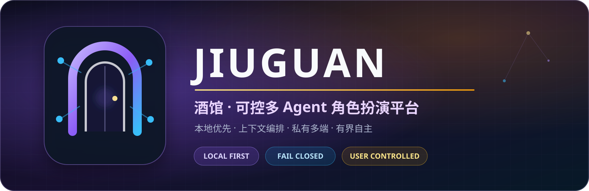

<p align="center">
  
</p>

<p align="center">
  <a href="README.md">简体中文</a> · <strong>English</strong>
</p>

# Jiuguan

Jiuguan is a **Windows-first, local-first** role-play chat host inspired by the asset workflow of
SillyTavern. It combines character cards, worldbooks, presets, Skills, persistent sessions,
streaming generation, private mobile access and a bounded multi-Agent runtime.

Jiuguan is not an official SillyTavern fork or affiliated project. SillyTavern focuses on a mature
front-end ecosystem; Jiuguan currently focuses on server-side state, context orchestration,
controlled autonomy and one source of truth shared by PC and phone.

> [!IMPORTANT]
> This public `v0.1.0` repository contains no user sessions, character cards, worldbooks, presets,
> learned Skills, installed plugins, API keys, device credentials, private hostnames or signing
> material. Empty asset lists on first launch are expected.

## Highlights

- React web client and Node.js host
- Character-card, worldbook, preset, regex and Skill management infrastructure
- SQLite session truth with optional PostgreSQL/pgvector semantic indexing
- Streaming turns, reconnect/recovery and mobile-oriented UI
- Generic plugin host and first-party CommandCode Provider source
- PolicyRouter, Context Compiler and bounded Harness infrastructure
- Tailscale-only private HTTPS launcher and Android packaging source

## Public-safe defaults

The normal chat path works after the user configures a Provider. Experimental autonomous lanes
start fail-closed:

| Capability | v0.1 default |
|---|---|
| Interactive Agent / bounded tool loop | Off |
| Preference and Style model learning | Off |
| Maintenance Harness | Off |
| Context Compiler live Agent execution | Off |
| Maintenance business writes | Unreachable |

No historical test session or authorization window is bundled. Enabling a lane requires an exact
session, a physical-request ceiling, a cost ceiling and a rollback policy.

## Quick start

Requirements: Windows 10/11 x64, Node.js `22.22.2`, pnpm `10.33.0`, Git and a modern browser.

```powershell
git clone https://github.com/conversition/jiuguan.git
Set-Location jiuguan

pnpm install --frozen-lockfile
pnpm public:verify
pnpm typecheck
pnpm build
```

Then run `一键启动.bat`. The local UI opens at `http://localhost:5173` and the API binds to
`127.0.0.1:17800`. Stop it with `停止.bat`.

Configure your own Provider in the UI, then import only content that you own or are permitted to
use. Local-first means data and credentials remain on the PC host; it does not mean that a
user-selected remote model runs offline.

## Mobile access

The recommended v0.1 mobile path is a browser over Tailscale private HTTPS. Join the PC and phone
to the same tailnet, enable MagicDNS and HTTPS Certificates, then run `私有远程启动.bat`. Jiuguan
does not enable Funnel or public port mapping.

APK source is included, but an APK must be built for the user's exact private HTTPS endpoint and
signing material.

## Documentation

- [Chinese installation and usage guide](docs/安装与使用.md)
- [Autonomous installation-agent handoff](docs/AGENT-自主安装交接.md)
- [Clean release manifest](CLEAN_RELEASE_MANIFEST.md)
- [Security policy](SECURITY.md)
- [Latest release](https://github.com/conversition/jiuguan/releases/latest)

## Contributing and license

Read [CONTRIBUTING.md](CONTRIBUTING.md) before opening a pull request. Do not post API keys, private
sessions, character content or raw logs in public issues.

Project code is released under the [MIT License](LICENSE). Third-party components retain their own
licenses and notices.
