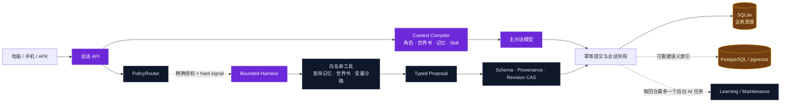

<p align="center">
  
</p>

<p align="center">
  <strong>简体中文</strong> · <a href="README.en.md">English</a>
</p>

<h1 align="center">酒馆 Jiuguan</h1>

<p align="center">
  <strong>把角色扮演对话，从“一次请求”升级为可恢复、可学习、可审计的本地运行系统。</strong>
</p>

<p align="center">
  <a href="https://github.com/conversition/jiuguan/releases/latest"></a>
  <a href="LICENSE"></a>
  
  
</p>

<p align="center">
  <a href="#-三分钟开始">快速开始</a> ·
  <a href="docs/安装与使用.md">完整安装</a> ·
  <a href="#-对话与-agent-架构">运行架构</a> ·
  <a href="https://github.com/conversition/jiuguan/releases">下载版本</a> ·
  <a href="https://github.com/conversition/jiuguan/issues">问题反馈</a>
</p>

> [!IMPORTANT]
> 这是 `v0.1.0` 公开预览版。仓库不附带角色卡、世界书、预设、Skill、会话、学习记录、
> API Key 或任何个人运行数据；首次启动看到空资产库是正常现象。

## ✨ 它是什么

Jiuguan 是一个 **Windows 优先、本地优先** 的角色扮演对话宿主。它沿用酒馆玩家熟悉的
角色卡、世界书、预设与 Skill 工作流，同时把会话恢复、上下文装配、记忆、移动端访问和
受控 Agent 编排放进同一套后端。

它受 SillyTavern 的资产工作流启发，但不是 SillyTavern 的官方分支或附属项目。SillyTavern
擅长成熟的前端生态；Jiuguan 当前更关注 **状态真值、对话编排、可控自主性和电脑—手机同库**。

### 与常见酒馆工作流的侧重点

| 维度 | 常见前端式酒馆 | Jiuguan v0.1 |
|---|---|---|
| 主要定位 | 丰富的聊天前端与扩展生态 | 本地对话宿主与 Agent 编排运行时 |
| 资产工作流 | 角色卡、世界书、预设 | 提供对应的导入、编辑和会话装配基础设施 |
| 上下文处理 | 以单轮提示词拼装为主 | Context Compiler、记忆检索、剧情索引与预算边界 |
| 长任务 | 通常交给单次模型请求或扩展 | 有界 Harness：轮数、Token、时钟和费用均可限制 |
| 状态写入 | 由脚本或扩展直接修改 | typed proposal → schema → provenance → revision CAS |
| 手机访问 | 浏览器或第三方部署 | Tailscale 私有 HTTPS，共用电脑端数据真值 |
| 默认安全策略 | 取决于配置和扩展 | Agent Lane 默认关闭，未授权即不运行 |

## 🧩 核心能力

| 模块 | 用途 |
|---|---|
| 🎭 角色与世界 | 角色卡、世界书、预设、正则与 Skill 的导入/编辑基础设施 |
| 🧠 上下文与记忆 | 会话快照、记忆检索、滚动摘要、剧情索引与可选 pgvector 语义索引 |
| 🤖 可控 Agent | PolicyRouter 判断是否准入；Interactive、Learning、Maintenance 三条 Lane 分离 |
| 🧰 Harness | 在明确的轮数、Token、时钟、物理请求和费用预算内调用白名单工具 |
| 🛡️ 可靠写入 | 幂等键、会话单活、断线恢复、typed proposal、schema 校验与 revision CAS |
| 🌐 多端同库 | 电脑网页、手机私有网页与 Android 容器共用电脑端会话和资产 |
| 🔌 Provider | OpenAI-compatible 接口与第一方 CommandCode Provider 源码 |
| 🗄️ 数据分层 | SQLite 保存业务真值；PostgreSQL/pgvector 可选，仅承载可重建语义索引 |

## 🗺️ 对话与 Agent 架构



普通回合仍可走稳定的主对话路径。Harness 不是“每回合都多调几个模型”，而是在出现冲突、
检索不足或明确授权的复杂任务时，让模型在预算内查证和行动。Agent 不直接改业务状态，先产出
可验证提案，再由确定性门禁决定是否写入。

## 🚀 三分钟开始

### 环境

- Windows 10 / 11（64 位）
- Node.js `22.22.2`
- pnpm `10.33.0`
- Git 和现代浏览器

### 安装

```powershell
git clone https://github.com/conversition/jiuguan.git
Set-Location jiuguan

pnpm install --frozen-lockfile
pnpm public:verify
pnpm typecheck
pnpm build
```

完成后双击：

```text
一键启动.bat
```

- 本机页面：`http://localhost:5173`
- 后端 API：`http://127.0.0.1:17800`
- 停止服务：`停止.bat`

进入页面后，在 Provider 面板填写自己的 Base URL、模型名和 API Key，再导入自己有权使用的
角色卡、世界书和预设。完整步骤见 [安装与使用](docs/安装与使用.md)。

## 📱 手机私有访问

Jiuguan 不要求把服务暴露到公网。电脑和手机加入同一个 Tailscale tailnet 后：

1. 启用 MagicDNS 与 HTTPS Certificates；
2. 电脑运行 `私有远程启动.bat`；
3. 手机打开电脑显示的 `https://*.ts.net` 地址；
4. 输入一次性配对码；
5. 手机与电脑访问同一个数据目录和会话真值。

启动器不会启用 Funnel，也不会把 Tailscale 设置为永久开机自启。APK 需要绑定使用者自己的
HTTPS endpoint 与签名材料，因此 Release 默认推荐手机浏览器方案。

## 🔐 Public-safe 默认边界

| 能力 | 首次启动状态 |
|---|---|
| 主对话 | 配置 Provider 后可用 |
| Interactive Agent / 工具循环 | 关闭 |
| Preference / Style 模型学习 | 关闭 |
| Maintenance Harness | 关闭 |
| Context Compiler 实时 Agent 执行 | 关闭 |
| Maintenance 正式业务写入 | 不可达 |

开启实验 Lane 前，应明确指定会话、物理请求上限、费用上限、失败是否计数以及回滚方案。
自动安装 Agent 必须遵守 [自主安装交接协议](docs/AGENT-自主安装交接.md)。

## 📁 项目结构

```text
apps/
  web/                 React 对话前端
  server/              会话 API、认证与 Agent 编排
  mobile/              Capacitor / Android 容器
  commandcode-proxy/   CommandCode 反代核心
packages/
  core/                角色卡、世界书、预设等领域模型
  prompt/              上下文计划、装配与预算
  memory/              SQLite / PostgreSQL 记忆层
  plugin/              插件宿主与运行边界
  proxy/               Provider 抽象
plugins/
  commandcode-provider/ 第一方 Provider 源码
tools/
  cli/                 管理与诊断工具
  release/             发布、APK 与清洁门禁
  windows/             本地/私有启动配置
```

## 📦 版本与下载

- 最新版本：[Jiuguan v0.1.0 · 首个公开清洁版](https://github.com/conversition/jiuguan/releases/tag/v0.1.0)
- 独立源码包：[jiuguan-v0.1.0-clean-source.zip](https://github.com/conversition/jiuguan/releases/download/v0.1.0/jiuguan-v0.1.0-clean-source.zip)
- 清洁版说明：[CLEAN_RELEASE_MANIFEST.md](CLEAN_RELEASE_MANIFEST.md)

每次公开提交或重新打包前运行：

```powershell
pnpm public:verify
```

该门禁会拒绝运行数据、凭据、个人绝对路径、私有 tailnet 主机、生成插件 bundle 和常见密钥格式。

## ⚠️ v0.1 已知边界

- 这是 Windows-first 公开预览版，不是面向所有系统的一键安装器。
- 不提供内置角色卡、世界书、预设或 Skill 示例。
- 私有开发仓库中依赖真实素材的测试未进入公开版。
- Agent 编排地基已经存在，但实验 Lane 默认关闭，不宣称开箱即用的全自动多 Agent。
- Release 不提供通用 APK；APK 必须由使用者为自己的私有 endpoint 构建。

## 🤝 参与项目

- 遇到问题：提交 [Bug / 使用反馈](https://github.com/conversition/jiuguan/issues/new)
- 有改进想法：提交 Issue，说明使用场景、预期结果和安全边界
- 准备贡献代码：从 `main` 建分支，保持 `pnpm public:verify`、`pnpm typecheck` 和
  `pnpm build` 通过后再提交 Pull Request
- 安全问题：请先阅读 [SECURITY.md](SECURITY.md)，不要在公开 Issue 中粘贴 Key、会话或日志原文

## 📄 License

项目代码采用 [MIT License](LICENSE)。第三方组件继续遵循各自的 LICENSE 与 NOTICE。

<p align="center">
  <sub>Local-first · Fail-closed · User-controlled</sub>
</p>
