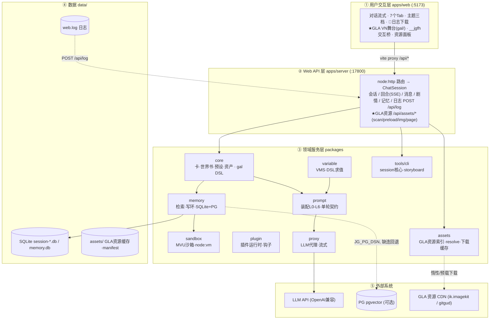

# 项目架构（jiuguan · 酒馆剧本引擎）

> 本文给 AI 协作与开发者作为项目架构快速入口，与 `CLAUDE.md`（编码规范）互补。
> 详尽的渐进式架构与变更日志见同仓库 `README.md`；本文是精简快照。
> 最后更新：2026-08-24（对齐 GLA 前端交互化）。

## 1. 定位

SillyTavern 类「角色卡 × 世界书」AI 剧本游玩平台，headless-first MVP。仓库根：`酒馆提示词Agent/jiuguan/`（pnpm workspaces monorepo）。

- 当前版本 **0.6.1**（根 + web + 前端日志 APP_VERSION 同步）
- 活跃分支：`feat/0.9.0-key-anchor-sandbox`；GLA 前端交互化在 `feat/gal-interactive-frontend`

## 2. 仓库布局（monorepo）

| 目录 | 职责 |
|------|------|
| `apps/web/` | 前端（React 18 + Vite 6）。`src/App.tsx` 主界面；tab 面板 `src/*Panel.tsx`；hooks `src/hooks/`；日志 `src/lib/logger.ts`；错误边界 `src/components/ErrorBoundary.tsx`；**`src/gal/` GLA 原生视觉小说舞台**（GalStage/GalPlayer/GalLayers/ChoiceOverlay/GalSegment/ExternalPage + `bridge.ts` `__jgfh` 交互桥） |
| `apps/server/server.ts` | 后端单文件 `node:http`（零框架，127.0.0.1:17800），REST + SSE，聚合各 packages |
| `packages/core/` | 卡/世界书/预设/正则/资产解析（chara PNG 解包）、lore 语义切分、工具 DAG、世界书扫描器、**`gal.ts` GLA `<gal_inface>` 场景 DSL 解析器** |
| `packages/assets/` | **GLA 远端资源**：`build-index`（扫卡 JSON 建 611 URL 索引/分类）、`resolve`（资源名→URL 命名规律）、`downloader`（磁盘缓存 + 惰性/预载下载） |
| `packages/memory/` | 记忆层：SQLite（node:sqlite 零原生依赖）+ FTS5 trigram + vec BLOB + 写环；**PG pgvector 真向量通道**（`pg-vector.ts`，`JG_PG_DSN` 缺连自动回退 SQLite）；独立记忆服务（可选）127.0.0.1:17600 |
| `packages/prompt/` | 提示词装配：L0-L6 七层上下文调度、`game_turn` 单轮契约（Zod 同源校验）、滑动窗口 + 滚动摘要、宏展开 |
| `packages/proxy/` | OpenAI 兼容 LLM 代理（tools + SSE 流式）、provider 自适应缓存、密钥管理 |
| `packages/variable/` | VMS 变量管理：三源命名空间、DSL 白名单求值、依赖图拓扑分层、规则执行、持久化 |
| `packages/sandbox/` | MVU 引擎沙箱（node:vm 白名单 + lodash 子集 + MvuBridge，魔法少女卡引擎零转译运行） |
| `packages/plugin/` | 插件系统：git URL 安装、node:vm 运行时、SillyTavern 扩展钩子映射（onMessageSend 等） |
| `tools/cli/` | headless CLI：`session.ts`（会话核心，CLI/Web 共用）、turn-runner/turn-loop、storyboard 导演分镜 + 导演模式（对话内选区→会话上下文分镜）、verify-* 验证脚本 |
| `tools/evaluator/` | A/B 评测器（召回 / 回合质量基线） |
| `data/` | **运行时数据**（卡 / 会话 db / 世界书 / 预设 / provider.json / 日志 / **GLA 资源缓存 `assets/`**），**gitignore，不入库** |

## 3. 运行时拓扑

### 分层总览（自上而下 ①→⑤，箭头为数据流方向）

```text
       用户浏览器
          │
          ▼
┌───────────────────────────────────────────────────────────────────────┐
│  ① 用户交互层   apps/web (React 18 + Vite 6 · http://localhost:5173)  │
│  对话流式打字机 │ 7 个 Tab 面板 │ 主题三档 │ 楼层刻度 │ 📄 日志下载      │
│  组件: App / SessionSetup / MemoryConsole / *Panel / MessageRuler     │
│  hooks: 滚动spy · 消息锚点 · 生成完成定位 · SSE 批合并(flushStream)    │
│  ★ GLA: gal/ 原生VN舞台(背景/立绘/对话框/选项) │ 资源面板 │ __jgfh桥    │
└───────────────────────────────────┬───────────────────────────────────┘
                 A fetch ① vite proxy  /api/* → 17800
                                    ▼
┌───────────────────────────────────────────────────────────────────────┐
│  ② Web API 层   apps/server/server.ts (node:http · 127.0.0.1:17800)  │
│  Method+Path 路由 → ChatSession(tools/cli/session.ts) 装配各 packages  │
│  会话: new(SSE阶段) resume history config delete                      │
│  回合: turn(SSE流式) regenerate abort                                 │
│  消息: delete · 剧情: story-index · 记忆: memory-search/state          │
│  资产/正则/Provider/插件 · 日志: POST /api/log → data/web.log          │
│  ★ GLA 资源: /api/assets/{status,scan,preload,img,clear,page}         │
└──────┬──────────┬──────────┬──────────┬──────────┬──────────┬─────────┘
       │          │          │          │          │          │
       ▼          ▼          ▼          ▼          ▼         (工具DAG / 插件钩子)
┌───────────────────────────────────────────────────────────────────────┐
│  ③ 领域服务层   packages/ (单一职责, monorepo 依赖, 装配器编排)         │
│  ┌───────────┐ ┌───────────┐ ┌───────────┐ ┌───────────┐ ┌─────────┐ │
│  │ core      │ │ memory    │ │ prompt    │ │ proxy     │ │variable │ │
│  │ 卡/世界书/ │ │ 检索+写环 │ │ 装配L0-L6 │ │ LLM代理   │ │ VMS变量 │ │
│  │ 预设/正则 │ │ SQLite+PG │ │ 单轮契约  │ │ OpenAI兼容│ │ DSL求值 │ │
│  │ 资产解析  │ │ bge向量   │ │ 滑动窗口  │ │ 流式/缓存 │ │ 依赖分层 │ │
│  │ gal DSL   │ └───────────┘ └───────────┘ └───────────┘ └─────────┘ │
│  └───────────┘ ┌───────────┐ ┌───────────┐ ┌───────────┐             │
│  ★ assets      │ sandbox   │ │ plugin    │ │ tools/cli │ ← session.ts │
│  GLA资源索引   │ MVU沙箱   │ │ 插件运行时 │ │ session核 │   CLI/Web    │
│  resolve/下载  │ node:vm   │ │ 钩子映射   │ │ storyboard│   共用核心    │
│  └───────────┘ └───────────┘ └───────────┘ └───────────┘             │
└───────┬──────────────────────────────────────────────┬──────────────┘
        │                                              │
        ▼                                              ▼
┌──────────────────────────────────┐  ┌─────────────────────────────────────────┐
│ ④ 数据与基础设施  data/          │  │ ⑤ 外部系统 (经 proxy / server 出网)     │
│ session-*.db SQLite(WAL)         │  │   LLM API (OpenAI 兼容, tools+SSE)      │
│ memory.db · 卡·世界书·预设       │  │   PG pgvector (可选, JG_PG_DSN)        │
│ provider.json · web.log (日志)   │  │   bge 向量模型 (本地 HF, 512维)        │
│ ★ assets/ GLA资源缓存+manifest   │  │   ★ GLA 资源 CDN (ik.imagekit.io/       │
│    (gitignore, 不入库)           │  │     gitgud.io: 背景/立绘/BGM/菜单)      │
└──────────────────────────────────┘  └─────────────────────────────────────────┘
```

### 每回合数据流（一次 send 的完整链路）

```text
[用户] 输入
   │
   ▼ ① fetch POST /api/turn (SSE)
[web] 乐观气泡(round0 user+assistant) → busy=true → 300s 超时兜底
   │
   ▼ ② 后端路由
[server] ChatSession.turn() 开始
   │
   ├─▶ 并行预计算 ── 记忆召回(RRF融合) ∥ 世界书激活(关键词/正则/概率) ∥ VMS变量求值
   ├─▶ 插件 onMessageSend (promptInject 注入)
   ├─▶ 装配 L0-L6 ── 系统核心 + NSFW分支 + 静态设定 + 预设块 + 动态状态 + 记忆块
   │                 + 滑动窗口原文 + 滚动摘要
   ├─▶ 模型 game_turn 工具调用 (1 往返, 经 proxy)
   ├─▶ 校验/归一化 / 失败重试(≤2) → 写环落库 (AM码全局唯一 + 双表一致)
   ├─▶ 插件 onProsePostProcess (链式改写) → 对话落库
   └─▶ MVU 引擎 tick → VMS 快照 → memory_state
   │
   ▼ ③ SSE 事件流回推
[web] delta(每帧批合并追加) → done(完整prose覆盖) → fetchHistory 对齐真实 round
   │
   ▼ ④ 收尾
[web] 刷新推进槽/剧情分支索引/会话预览 → busy=false → 日志落 data/web.log
```

### GLA 场景数据流（角色卡 HTML 交互，★ 归属：core 解析 → web 舞台 → assets 资源）

```text
[AI 回复含 <gal_inface>] 
   ▼ core 显示管线 (regex.applyDisplayRules Phase0 extractGalBlocks 抽令牌 + splitGalSegments 分段)
[web] 叙事段→markdown 气泡 ∥ gal 段→GalSegment
   ├─▶ 原生模式: GalStage ← GalPlayer 消费指令(背景/立绘/对话框/选项)
   │    资源  → server 惰性下载缓存 data/assets/ → 同源出图
   └─▶ 外部模式(卡自带前端): /api/assets/page 服务端代理抓页 → 沙箱 iframe → __jgfhChoice 回传
[玩家点 [choice] 选项] → galRuntime.sendText(opt) → 复用 /api/turn 发用户消息 → AI 续写新场景
预载: 资产面板 → POST /api/assets/preload {card} (SSE 进度) → packages/assets downloader 落盘 data/assets/cache/
```

### 记忆写环要点

- 通道 A：FTS5 BM25 + LIKE 兜底 + 实体映射 + AM 码直查（确定性）∥ 通道 B：bge-small-zh-v1.5 语义向量 ∥ 通道 C：时效 → **RRF 融合 + min-max 置信门控**，叠加 **记忆衰减/访问提升**（Ebbinghaus 遗忘曲线 + 被引用次数，`JG_MEMORY_DECAY_*` 可调，schema v4），注入块标来源/置信度，低置信标 `[存疑]`。
- PG 通道：`packages/memory/pg-vector.ts`，连接 `JG_PG_DSN`（默认 localhost），缺连 `health=false` 优雅回退 SQLite；命名空间按卡/会话隔离，多世界书共享、跨卡不串扰。

### 可视化版本（Mermaid，GitHub/VSCode 等平台可直接渲染）



## 4. 端口与服务

| 服务 | 端口 | 备注 |
|------|------|------|
| Web 前端（vite dev） | 5173 | `pnpm web:dev` |
| Web API | 17800 | `pnpm web:server`，`JG_WEB_PORT` 可改 |
| 独立记忆服务（可选） | 17600 | `packages/memory/src/api.ts`（/health /recall /search /update /state /init） |
| PG 向量库（可选） | — | `JG_PG_DSN`，缺连回退 SQLite |

启动：双击 `一键启动.bat`（后端 + 前端 + 浏览器）；CI 一键 `pnpm test`（核心/记忆/提示词/变量/沙箱/插件/分镜/回退/中止/上下文/A-B 全链验证）。

## 5. 前端关键机制（排查「挂掉 / 白屏 / 卡死」先读这里）

- **日志模块 `src/lib/logger.ts`**：分级（debug/info/warn/error）＋分类（turn/sse/session/render/sys）；全局 `window.onerror` / `unhandledrejection` 捕获；环形缓冲 2000 条 + 侧栏 📄 一键下载 `.log`；去抖批量 POST `/api/log` → 后端逐行追加 `data/web.log`。**排查先看 `data/web.log`：`render` 级错误 = 渲染异常（ErrorBoundary 已兜底）；`turn` 级「生成超时」= 上游挂起。**
- **ErrorBoundary**（`src/components/ErrorBoundary.tsx`）：顶层 + 消息列表两层，单条坏消息渲染抛错不再整页白屏，落 `render` 级日志并给出可恢复面板。
- **生成超时兜底**：`send()` / `regenerateMessage()` 300s 超时自动 abort（`genTimedOutRef` 区分「用户停止」vs「超时」），杜绝 `busy` 卡死后 60fps 滚动追随空转冻结。
- **流式渲染**：SSE delta → rAF 批合并逐帧追加（`flushStream`，有 delta 才滚动追随）→ 结束 `done` 覆盖完整 prose；流式期用 `StreamText` 纯文本、结束后切 `MarkdownMessage` / `HtmlMessage`（HTML 经 `sanitizeHtml` 防 XSS，保留 style）。
- **消息锚点**：`useMessageRefs` + 楼层刻度 `MessageRuler` + 滚动 spy/定位（`useScrollSpy` / `useScrollToMessage` / `useAutoScrollToMessage`）；`registerAnchor(key)` 已在 MessageRow 内按 key 缓存 ref，避免每渲染抖动。
- **GLA 前端交互（★ 角色卡 HTML 交互化）**：`<gal_inface>` 场景经 `applyDisplayRules` Phase0 抽令牌（`extractGalBlocks`）+ `splitGalSegments` 分段 → `GalSegment` 渲染**原生 VN 舞台**（`src/gal/`：背景/多槽位立绘/对话框/选项；空格·滚轮·点击推进，双击全屏，`[choice]` 点击即 `sendText` 发消息触发 AI 续写）。卡自带完整前端页时可切「卡自带前端」（`/api/assets/page` 服务端代理抓页 + 沙箱 iframe + `__jgfhChoice` helper 回传）。iframe/舞台与宿主统一走 **`__jgfh` postMessage 协议**（`gal/bridge.ts`：height/size 测高、choice/draft 回传聊天、rpc 远程调用；宿主 `sendText()` 公共发送路径复用 `/api/turn`）。**排查**：舞台不显示/空白 → 先看资产面板「GLA 远端资源」是否已扫描 + 预载（`data/assets/`），资源经 `/api/assets/img` 同源惰性下载缓存。

## 6. 后端端点速查（apps/server/server.ts）

| 分组 | 端点 |
|------|------|
| 会话 | `GET /api/cards` `GET /api/sessions` `POST /api/session/new`(SSE) `POST /api/session/resume` `GET /api/session/:id/history` `GET /api/session/:id/config` |
| 回合 | `POST /api/turn`（SSE：thinking→streaming→delta→done） |
| 消息操作 | `POST /api/session/:id/regenerate {round}`（SSE）`POST /api/session/:id/message/delete {round, mode}` `POST /api/session/:id/turn/abort` |
| 剧情/会话 | `GET /api/session/:id/story-index?round=N` `POST /api/session/:id/delete` |
| 记忆 | `POST /api/session/:id/memory-search` `GET /api/session/:id/memory-state|-arc|-meta` |
| 调试 | `POST /api/session/:id/lorebook-scan` `GET /api/session/:id/variables|-turn-state|-lorebook-entries` |
| 资产 | 卡/世界书/预设的 列表/读取/导入/导出/保存/删除（json+png 双格式，源只读 + 用户层 `data/` 可编辑） |
| **GLA 资源（★）** | `GET /api/assets/status` · `POST /api/assets/scan {card}` · `POST /api/assets/preload {card}`（SSE 进度）· `GET /api/assets/img?url=`（惰性下载 + 同源出图缓存）· `POST /api/assets/cache/clear` · `POST /api/assets/page {url}`（外部前端页服务端代理） |
| 正则 | `GET /api/regex-rules` `POST /api/regex-rules/save|delete|import-card` `POST /api/regex/test` |
| Provider | `GET /api/provider` `POST /api/provider/test|key` |
| 插件 | `GET /api/plugins` `POST /api/plugins/install` `POST /api/plugins/:id/enable|disable|uninstall|update` |
| 导演模式（0.9.x） | `POST /api/session/:id/director {selectedText, round, role, shots?, voice?, workflow?}`（SSE：stage 阶段进度→done 含 Markdown 下载；复用会话真实记忆/世界书/变量跑分镜管线）+ `GET /api/storyboard/workflows` `POST /api/storyboard/run`（独立空库版） |
| 日志（0.6.1+） | `POST /api/log`（前端日志批量落盘 `data/web.log`，双层脱敏） |
| 健康 | `GET /api/health` |

## 7. 关键配置（.env.local，gitignore）

| 变量 | 用途 |
|------|------|
| `JG_API_BASE` / `JG_API_KEY` / `JG_MODEL` | LLM 连接（UI Provider 面板写 `data/provider.json` 优先，唯一权威） |
| `JG_WINDOW_N` / `JG_WINDOW_TOKENS` / `JG_SUMMARY_ROUNDS` / `JG_LONGTERM_TOKENS` | 滑动窗口 + 滚动摘要 |
| `JG_PG_DSN` | PG pgvector 连接串（缺连回退 SQLite） |
| `JG_WEB_PORT` | 后端/代理端口（默认 17800） |

## 8. 技术栈速览

| 层 | 技术 |
|----|------|
| 前端 | React 18 · Vite 6 · CSS 变量三主题 · react-markdown + remark-gfm + rehype-highlight · GLA VN 舞台(CSS 动画 + fullscreen) |
| 后端 | node:http（零框架）· SSE · node:sqlite（零原生依赖） |
| 核心 | zod（契约共享）· FTS5 trigram · bge-small-zh-v1.5 · node:vm 沙箱 · pg pgvector（可选） |
| 运行 | Node ≥ 22.5 · pnpm 10 · Windows |

## 相关 memory（根因类结论）

- [[jiuguan-frontend-crash-061]]：前端「一次对话打挂」双根因（无 ErrorBoundary 白屏 / 回合卡死 rAF 空转冻结）与 0.6.1 修复。
- [[jiuguan-round9-context-anchor-fix]]：第 9 轮卡死（key 双源分歧 / 窗口塌陷 / 滚动摘要不触发）。
- [[jiuguan-worldstate-rag-budget-fix]]：over-cost 裁剪 + 检索召回失败与预算修复。
- [[jiuguan-0-2-0-bug-root-causes]]：0.2.0 挂掉 / 渲染 / 中止三问题。